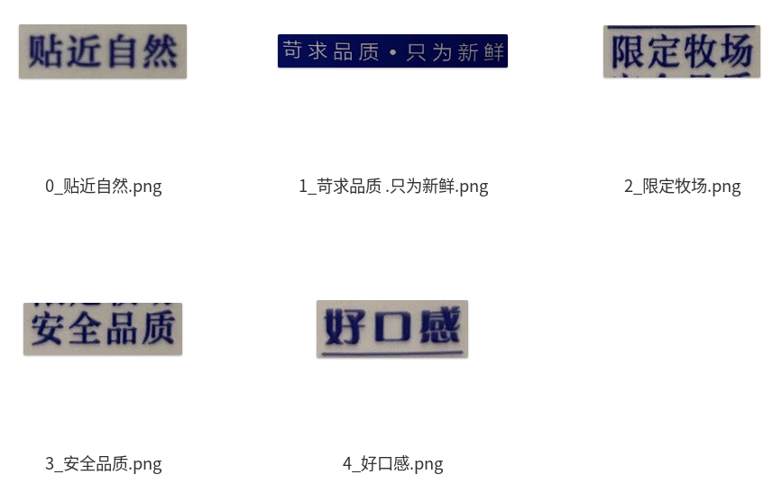

# ocr-word-cropper

This project is an image processing tool based on EasyOCR, designed to recognize specific text in images and crop the corresponding areas.

## concat

## crop

    
    

### Dependencies

- EasyOCR
- Pillow

### Usage

1. Install dependencies: `pip install -r requirements.txt`
2. Config the target words in `config.py` and put your images in `images` folder
3. Run!

### Todo

1. API for upload image to github
2. Only crop the target words
3. GUI for easy usage

### Ref

Thanks to `EasyOCR`!
